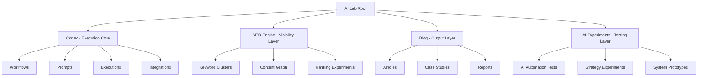
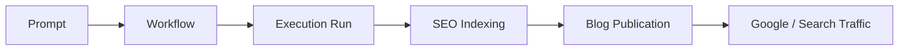
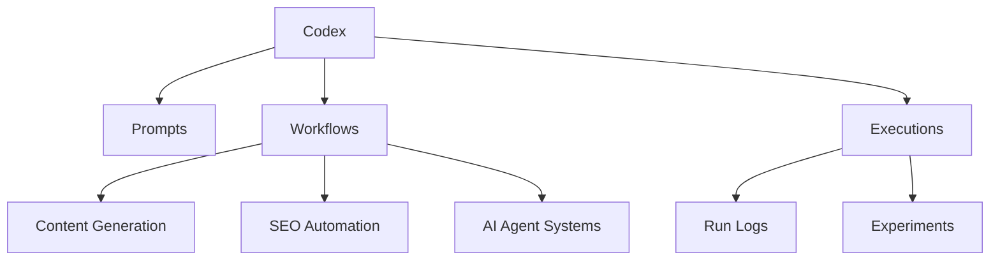
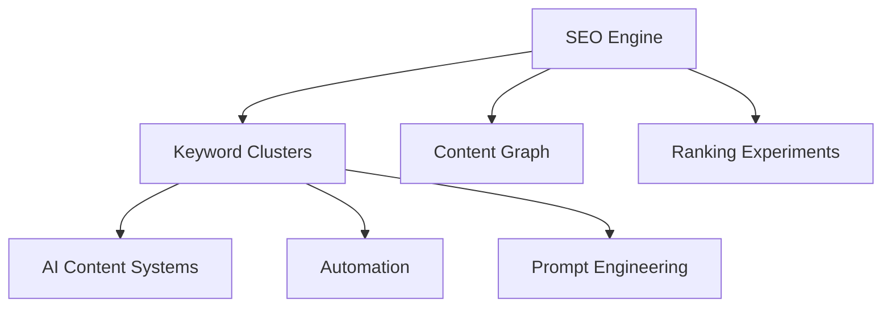
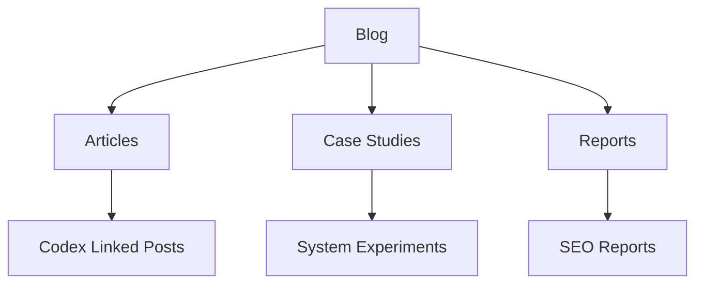
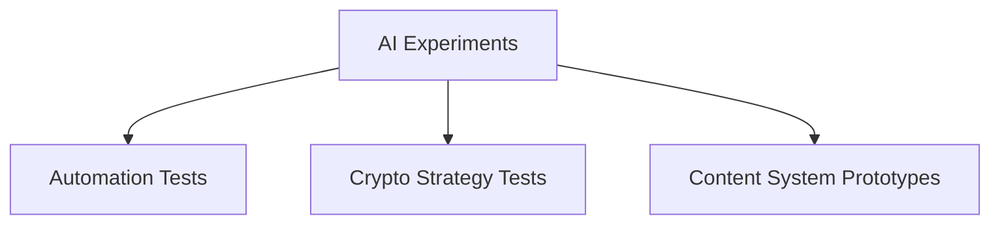

# AI Lab — System Map

This page visualizes AI Lab as a connected content operating system.

---

## High-Level Architecture

---

## Content Lifecycle Flow

---

## Codex Execution Graph

Entry: `/codex`

---

## SEO Engine Structure

Entry: `/seo-engine`

---

## Blog Output Structure

Entry: `/blog`

---

## Experiment Layer

Entry: `/ai-experiments`

---

## Cross-System Links

### Codex -> Blog

Every blog post should reference:

- `workflow_id`
- `execution_id`
- `commit_hash` (optional)

### Blog -> SEO Engine

Each article contributes to:

- keyword cluster
- content graph node

### Execution -> GitHub

Each execution may map to:

- GitHub commit
- workflow version
- system snapshot

---

## Navigation Entry Points

- `/ai-lab`
- `/ai-lab/map` (you are here)
- `/codex`
- `/seo-engine`
- `/blog`
- `/ai-experiments`

---

## System Definition

AI Lab is a living content operating system:

- ideas are executed (Codex)
- visibility is structured (SEO Engine)
- outputs are published (Blog)
- systems are tested (Experiments)
