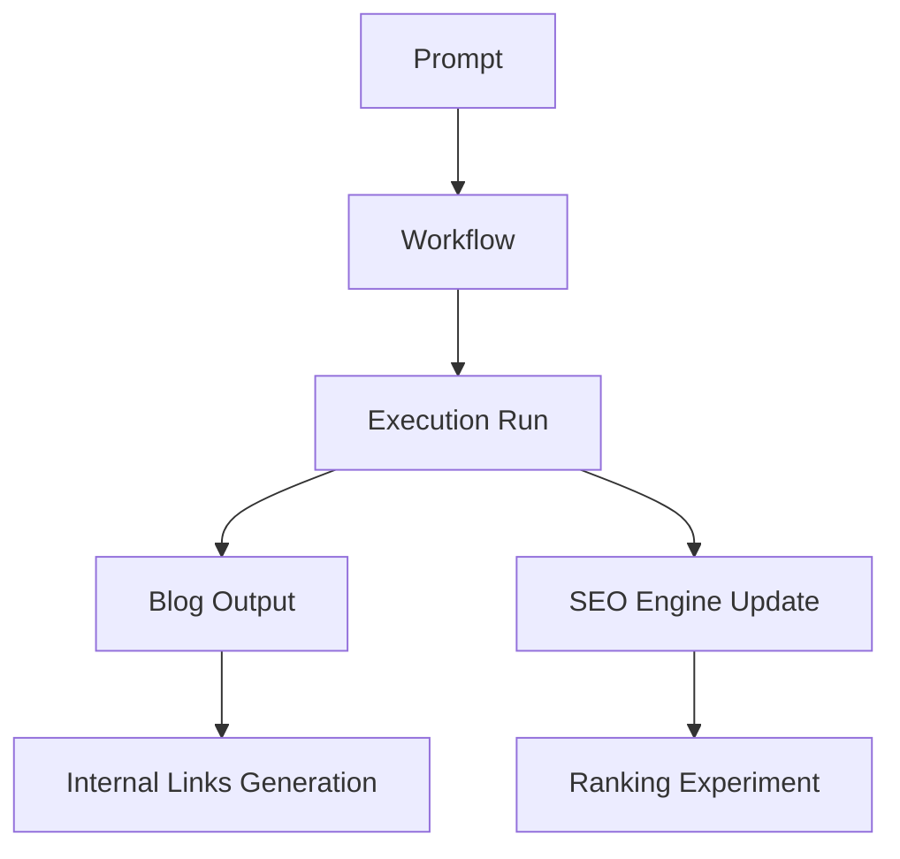

# AI Lab Automation Layer

Automation Layer connects Codex executions, Blog outputs, and SEO Engine updates into a self-propagating system.

It allows:

- Automatic blog post generation from executed workflows
- SEO content graph auto-updates
- Internal linking enforcement
- Traceability from prompt -> execution -> commit -> output

---

## Workflow



---

## Metadata Template (Front Matter)

All blog / experiment pages should include:

```yaml
workflow_id: content-generation
execution_id: run-2026-05-29-01
prompt_id: persona-system-v1
cluster: ai-content-systems
internal_links:
  - /codex/workflows/content-generation
  - /seo-engine/content-graph
  - /blog/sample-article
commit_hash: 8f3a2d
```

---

## Internal Linking Rules

1. All Blog Posts must link to:
- their Codex workflow
- related blog posts in the same SEO cluster
- top-level hub page (`/ai-lab/overview`)

2. All Codex Pages must link to:
- execution runs
- blog outputs (if available)
- relevant SEO cluster

3. SEO Engine Nodes must link to:
- cluster hub pages
- supporting blog / codex nodes

---

## Automation Script Pseudocode

```python
for execution in codex.executions:
    blog_post = generate_blog(execution)
    cluster = assign_cluster(blog_post)
    related_nodes = find_related_nodes(cluster)
    blog_post.front_matter['internal_links'] = related_nodes
    update_seo_graph(blog_post)
    commit_to_github(blog_post)
```

---

## Key Principles

1. Everything is traceable
2. Everything is connected
3. Everything is repeatable
4. SEO-driven design

---

## Next Steps for Full Automation

1. Add CI workflow to:
- trigger blog generation on new execution
- auto-update `/seo-engine/content-graph.md`
- auto-generate internal links

2. Enable cluster scoring for:
- link density analysis
- authority propagation

3. Track ranking experiments continuously

---

This layer completes the loop:

`Prompt -> Workflow -> Execution -> Blog -> SEO -> Internal Links -> Rank -> Feedback`
