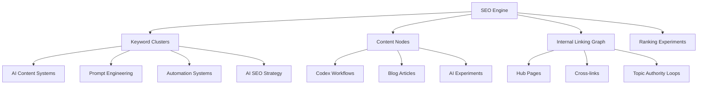

# SEO Engine — Content Graph System

SEO Engine defines how AI Lab content is structured, discovered, and ranked.

---

## Core Idea

Traditional SEO is keyword-based.

AI Lab SEO is graph-based.

`Keyword -> Cluster -> Node -> Connection -> Authority`

---

## Content Graph Overview



---

## Keyword Cluster System

### Cluster 1: AI Content Systems

Focus:

- content generation
- automation pipelines
- AI writing systems

Linked to:

- `/codex/workflows/content-generation`
- `/blog/*`

### Cluster 2: Prompt Engineering

Focus:

- persona systems
- writing engines
- structured prompts

Linked to:

- `/codex/prompts/*`
- experiment outputs

### Cluster 3: Automation Systems

Focus:

- AI agents
- workflow automation
- system orchestration

Linked to:

- Codex executions
- GitHub workflows

### Cluster 4: AI SEO Strategy

Focus:

- ranking experiments
- content graph optimization
- search behavior modeling

Linked to:

- `/seo-engine/*`
- blog performance tracking

---

## Content Node Model

| Node Type | Source | Role |
| --- | --- | --- |
| Workflow | Codex | Execution logic |
| Prompt | Codex | Intelligence design |
| Execution | Codex | Runtime record |
| Blog Post | Blog | Output |
| Experiment | AI Lab | Testing unit |

---

## Graph Linking Rules

### Rule 1 — Every node has a parent cluster

No orphan content.

### Rule 2 — Every blog post links back to Codex

Example metadata:

```yaml
workflow_id: content-generation
execution_id: run-2026-05-29-01
cluster: ai-content-systems
```

### Rule 3 — Every cluster has at least one Hub page

Example:

- AI Content Systems -> `/codex/workflows/content-generation`
- Prompt Engineering -> `/codex/prompts/writing-engine`

### Rule 4 — Internal links form authority loops

`Blog -> Workflow -> Prompt -> Blog`

---

## Ranking Strategy Model

SEO Engine uses three ranking signals:

### 1. Structural Depth

- Hub pages = highest authority
- leaf nodes = supporting content

### 2. Link Density

- strong clusters = higher ranking
- isolated pages = weak ranking

### 3. Execution Traceability

Prompt -> Workflow -> Execution -> Blog = full traceability score.

---

## Content Graph Lifecycle

`Idea -> Prompt Design -> Codex Workflow -> Execution Run -> Blog Output -> SEO Indexing -> Graph Reinforcement`

---

## Feedback Loop System

SEO Engine evolves through:

- search performance data
- internal link analysis
- content cluster growth
- execution success rate

---

## Integration With AI Lab

SEO Engine connects to:

- `/codex`
- `/blog`
- `/ai-lab/map`

---

## System Principle

SEO here is structure design for search comprehension.

---

## Final Statement

SEO Engine is the memory layer of AI Lab.

It determines what is understood, discovered, and ranked.
